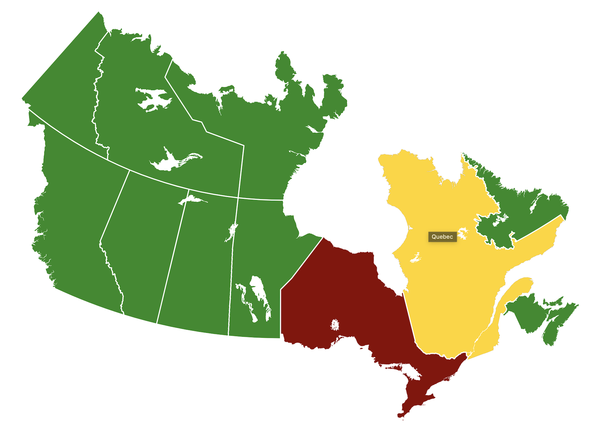

# react-canada-map | React Component for an Interactive Map of Canada with Typescript Support

The map of Canada is divided into provinces and territories, each of which can have custom styles and click interactions.

## Example



## Installation

Requires react 17 or higher. Compatible with JS and Typescript.

Run:

yarn add react-canada-map

or

npm install react-canada-map --save

## Usage

Javascript Example:

```javascript
import React from "react"
import CanadaMap from "react-canada-map"

function App() {
  const mapClickHandler = (province, event) => {
    console.log("province clicked: ", province)
  }

  const customizeProvince = () => {
    return {
      ON: {
        fillColor: "DarkRed",
        onHoverColor: "black",
      },
      NB: {
        fillColor: "#000000",
      },
      QC: {
        onHoverColor: "#FF69B4",
      },
    }
  }

  return (
    <CanadaMap
      customize={customizeProvince()}
      fillColor="ForestGreen"
      onHoverColor="Gold"
      onClick={mapClickHandler}
    ></CanadaMap>
  )
}

export default App
```

Typescript Example:

```typescript
import React, { Component } from "react"
import CanadaMap, { Provinces } from "react-canada-map"

interface Props {}
interface State {}

class App extends Component<Props, State> {
  clickHandler = (prov: Provinces) => {
    if (prov === Provinces.AB) {
      console.log("You clicked on: ", prov)
    }
  }

  render() {
    const customization = {
      [Provinces.AB]: {
        fillColor: "red",
      },
    }
    return (
      <CanadaMap
        customize={customization}
        onClick={this.clickHandler}
      ></CanadaMap>
    )
  }
}

export default App
```

## Props

| prop                | description                                         | default-value |
| ------------------- | --------------------------------------------------- | ------------- |
| `onClick`           | The generic click handler                           | null          |
| `width`             | The `width` for rendering, numeric, no `px` suffix  | 1113          |
| `height`            | The `height` for rendering, numeric, no `px` suffix | 942           |
| `defaultFillColor`  | The default color map fill color                    | #D3D3D3       |
| `defaultHoverColor` | The default color for a province on hovor           | #ffffff       |
| `customize`         | customization options for a specific province       | {}            |

The onClick function optionally takes the province abbreviation (see [Types](#Types) below) and the MouseEvent (type of React.MouseEvent) as arguments, allowing you to take custom actions depending on which province was clicked.

The customize object maps province abbreviations to an object in which you can specify the `fillColor` and `onHoverColor` strings to customize individual provinces / territories.

## Types

In Javascript, province abbreviations are passed as strings.

In Typescript, the Provinces enum can be imported and used as shown in the Typescript example above.
Additionally, the ProvinceCustomizations object can be imported, which declares the interface for the objects stored in 'customize'.

The possible province / territory abbreviations are:

- "BC"
- "AB"
- "SK"
- "MB"
- "ON"
- "QC"
- "NB"
- "NS"
- "PE"
- "NL"
- "YT"
- "NT"
- "NU"

# License

[MIT](LICENSE)

# Sources

The graphics are based on this open source [SVG file](https://commons.wikimedia.org/wiki/File:Canada_blank_map.svg).
The package is based on react-usa-map.
